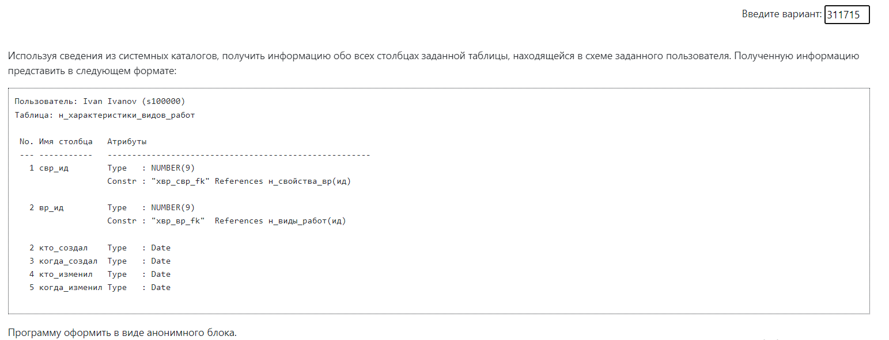

### Лабораторная работа №1

- Условие:

- Особенности:

1) Реализован ввод как юзера, так и таблицы. В случае отсутствия таблицы у юзера -- выводится соответствующее сообщение.

2) Реализована выборка всех Constraint(ограничений) для таблицы из pg_constraint. Была некоторая сложность с тем, что в данной таблице для ограничения пишется массив номеров атрибутов, к которым относится ограничение. Поэтому запрос содержит проверку номера атрибута в массиве атрибутов.

